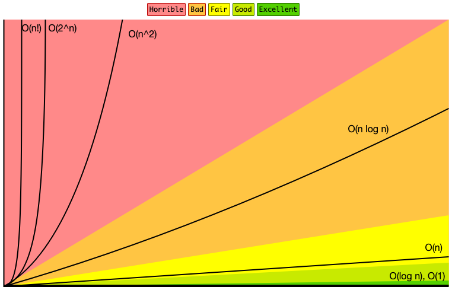

Big O notation, or Big-O, is a mathematical notation that describes the complexity of an algorithm. Simply, it describes how an algorithm scales in relation to its input size.

Let's jump straight in and look at some examples.

### O(1)

Constant time complexity. Algorithms _always_ take the same amount of time to execute, regardless of input size. For example, returning the first element in a list.

Imagine a function is given a list, and it takes 1 minute to process each element. The following function will always take 1 minute to complete, regardless of the input size.

___Example of an O(1) algorithm:___
```javascript
function(list) {
    return process(list[0])
}
```

### O(n)

Linear time complexity. Algorithm performance scales linearly with the input size. For example, checking if something exists in a list.

___Naive example of an O(n) algorithm:___
```javascript
function(list, item) {
    let found = false
    for (let el of list) {
        process(el)
        if (item === el) {
            found = true
        }
    }
    return found
}
```

That naive implementation will do the trick, but it *always* iterates through the *entire* array, even if the item is found early in the array, it's very wasteful.

___Better example of an O(n) algorithm:___
```javascript
function(list, item) {
    for (let el of list) {
        process(el)
        if (item === el) {
            return true
        }
    }
    return false
}
```

That's better! It will return as soon as it finds the item. 

OK, I'm sure you're wondering, are these two algorithms the same Big-O complexity? The answer is yes. But, "it's clear from the code the second one will perform better most of the time" I hear you say... and you're correct! These functions will only perform the same when the item we are searching for is in the last array position, or when the item does not exist. But most of the time the second function will perform better.

Then why are both of these algorithms classified as O(n)? 

Big-O is used to describe the _worst case scenario_. In both functions, the worst case scenario is the same, for the reasons I just mentioned. That being said, you should absolutely use the second one real applications.

Expanding on the scenario above, if the second algorithm above was given an input of size 100, in the worst case, it would take 100 minutes. If the input size was 200, it would take 200 minutes.

### O(n^2)

Quadratic time complexity. Let's start with the code example this time.

___Example of an O(n^2) algorithm:___
```javascript
function(list, item) {
    for (let a of list) {
        for (let b of list) {
            process(a, b)
        }
    }
}
```

This time, we're doing a loop inside a loop. If the input size is 4, `process()` will be executed 16 times. For each iteration of the outer loop, the inner loop does a full cycle. This is the best way to spot a O(n^2) algorithm; if you observe a double loop based on the input, think _n squared_, or _n^2_.

Looking at some numbers will demonstrate exactly how poorly O(n^2) algorithms perform.

Assuming each operation takes 1 minute, given an input of size 100;
- O(n) algorithms will take 100 minutes.
- O(n^2) algorithms will take 10,000 minutes. That's 166 hours or 7 days.

### O(log n)

Logarithmic time complexity. Algorithm performance scales with the logarithm of the input.

Logarithms are the inverse of exponentiation. Here's a quick recap;

___Log base 2___
  - [log(2) = 1] is the same as [2^1 = 2]
  - [log(4) = 2] is the same as [2^2 = 4]
  - [log(8) = 3] is the same as [2^3 = 8]
  - [log(16) = 4] is the same as [2^4 = 16]

___Log base 10___
  - [log(10) = 1] is the same as [10^1 = 10]
  - [log(100) = 2] is the same as [10^2 = 100]
  - [log(1000) = 3] is the same as [10^3 = 1000]
  - [log(10000) = 4] is the same as [10^4 = 10000]

A real-world example of an O(log n) algorithm is the [binary search.](https://en.wikipedia.org/wiki/Binary_search_algorithm)

The binary search algorithm works like this;
 - Given an ascending sorted list,
 - Find the midpoint, split the array in half and compare the midpoint to the item you are searching for,
 - If the item is larger than the mid, take the right half, otherwise, take the left half,
 - Repeat until you find the item.

It is categorized as a 'divide and conquer' algorithm, can you see why?

So, how do we know that it is O(log n)? 

Think about the first step of the binary search, it discards the __half of the array__. That means if the input size is doubled, after just one iteration the input size is back to where it was before.

Therefore, it will only take 1 more step each time the input is doubled. Double it, one more step, etc.

Hopefully, you've gathered that O(log n) offers a far greater performance than O(n).

### In Closing

The examples through this post are contrived, but it's clear algorithm complexity can have a __huge__ impact on performance. It doesn't take too much imagination to see how choosing the wrong algorithm can negatively impact user experience and even business costs.

The [wiki](https://en.wikipedia.org/wiki/Time_complexity) on this topic is a great resource to learn about many of the other Big-O notations not mentioned in this blog post.

If you're a visual learner you should definitely check out the [Big-O cheat sheet](http://bigocheatsheet.com). They even have a poster you can print off and stick on the wall above your desk.



_Reference: http://bigocheatsheet.com