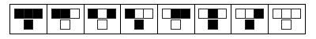

import { State, Observe } from 'mdx-observable'
import Button from '$components/Button'
import CellularAutomata from '$components/blog/cellular-automata/CellularAutomata'

A cellular automaton is a grid of cells constructed of a series of time based rules based on neighboring cells.

Simply, the state of each cell is determined by the state of the surrounding cells.

Let's break that down, here's an example;

<State initialState={{ isRandom: false }}>
<Observe>
    { ({isRandom}) => (<CellularAutomata isRandom={isRandom} />) }
</Observe>

Looks cool right?

That is a real JavaScript/Canvas implementation of [Rule 150](http://atlas.wolfram.com/01/01/150/). The code can actually support any of the rules, [take a look](https://github.com/arrwhidev/cellular-automata/blob/master/wolfram.js) - it's pretty flexible! These rules do not change over time. Each cell is computed only once, based on an initial state, working left to right, top to bottom.

The initial state is the first row. In this example every cell is **OFF** except the middle cell, which is **ON**.

What would a random initial state look like?

<Observe>
  {({ setState }) => (
    <Button text="Randomize!" onClick={() => setState(s => ({ isRandom: true }))}/>
  )}
</Observe>
</State>

Scroll up to see what that did to the canvas above.

## Rules

Each rule comprises of 4 nodes in a _T_ shape; three across the top, one below in the middle.

The bottom cell represents the state of the cell that the rule is describing.

The nodes in the top row represent the absolute position and state of neighboring cells.

These are the states for Rule 150;



_Reference: http://atlas.wolfram.com/01/01/150

First rule;

> if the cell directly above and to the left is **ON**

> and the cell directly above is **ON**

> and the cell directly above and to the right is **ON**

> then the cell should be **ON**

Second rule;

> if the cell directly above and to the left is **ON**

> and the cell directly above is **ON**

> and the cell directly above and to the right is **OFF**

> then the cell should be **OFF**


A function to describe a rule may look something like;

 ```js
function rule150(grid, x, y) {
    if (grid[y-1][x-1] === true &&
        grid[y-1][x] === true &&
        grid[y-1][x+1] === false) {
        grid[y][x] = false;
        return;
    }
}
```

Simply. that's it. 

To yield different results only the rules need to change.

## What's next?

As fascinating as static celluar automaton are, dynamic things are way cooler! My next post will cover this. Specifically, Conway's Game of Life.

## Footnote

I discovered this topic by watching [this video](https://youtu.be/bc-fVdbjAwk) on the fantastic YouTube channel, funfunfunction.
